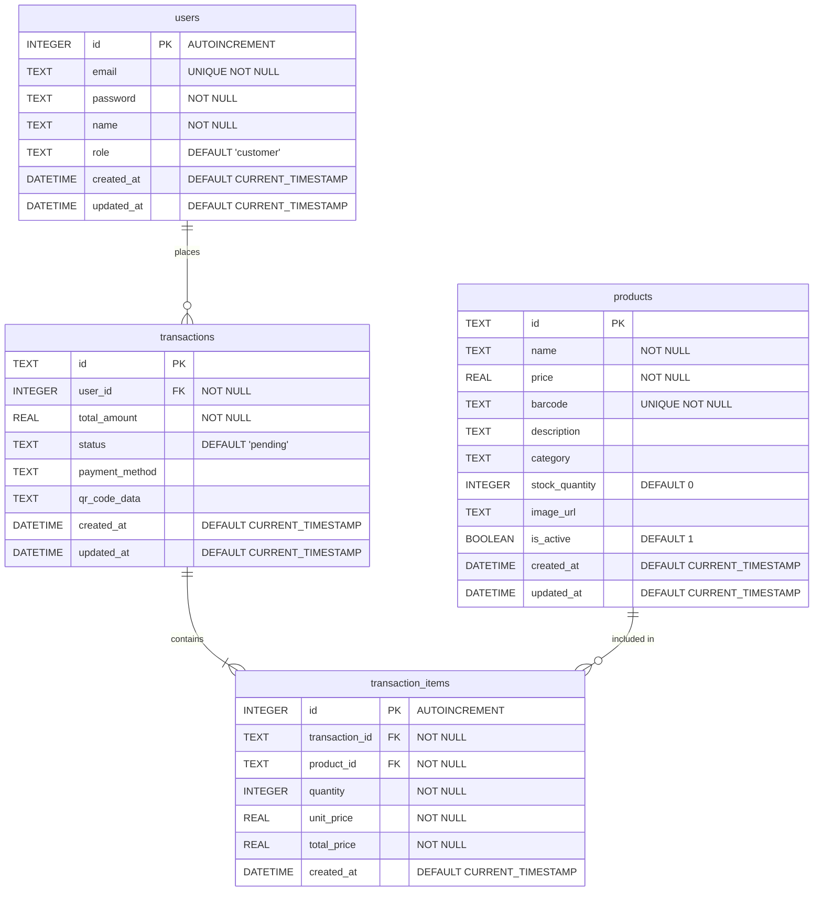

# Super-Market Self-Checkout System Database Schema

Below is the Entity-Relationship (ER) diagram for the SQLite database based on the initialization script (`backend/database/init.js`).

## Table Descriptions

- **`users`**: Stores user account information ranging from regular customers to staff and admins.
- **`products`**: Maintains an inventory of all items available for scanning and checkout. Each product has a unique `barcode`.
- **`transactions`**: Records all checkout transaction occurrences associated with a specific user. The final state tracking is based on the `status` string.
- **`transaction_items`**: Junction mapping individual products that were scanned into a specific transaction, keeping track of individual quantities and prices at the time of purchase.
